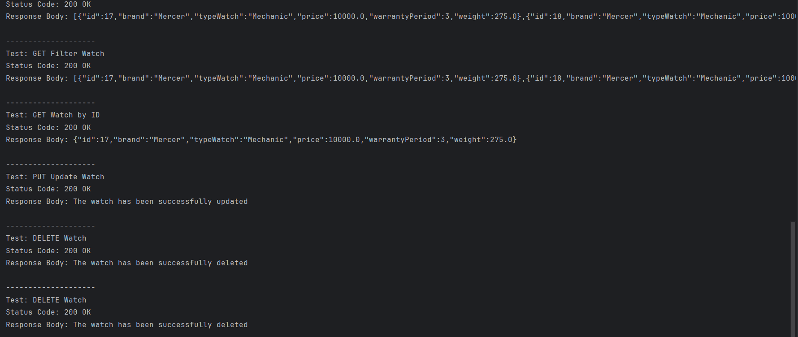
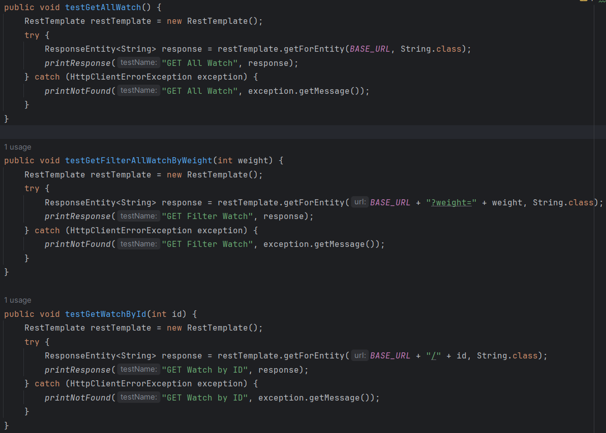
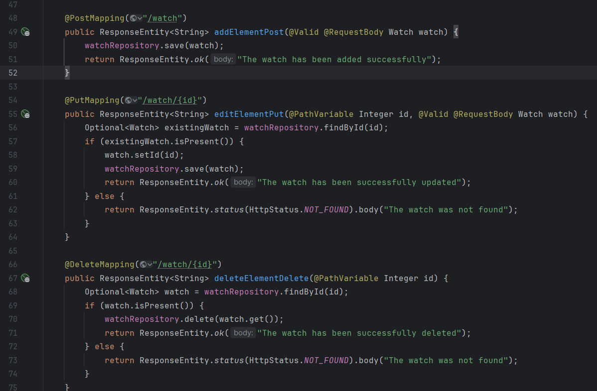

## Практическая работа №7
- Смолянинов Ярослав КИ21-16/1Б
- Вариант №23 (Часы)

Чтобы развернуть у себя базу данных, вам необходимо установить PostgerSQL на свое устройство, после чего запустить ее.
Создайте новую базу данных, войдя в консоль psql под своими данными и выполните следующие команды:
````
CREATE DATABASE postgres;
CREATE USER postgres WITH PASSWORD 'postgres';
\quit;
````

Затем подключиться к базе данных с помощью команды:
``
psql -d postgres -U postgres
``

И теперь вставьте следующий текст:
````
CREATE TABLE watch (
id SERIAL PRIMARY KEY,
brand VARCHAR(255) NOT NULL,
type_watch VARCHAR(255) NOT NULL,
price numeric(8, 2) NOT NULL,
warranty_period int NOT NULL,
weight numeric(8, 2) NOT NULL
);
````
Таблица "watch" будет создана. Теперь вы можете запустить файл Laba7.jar и подключиться к базе данных.

Для компиляции и запуска проекта нужно ввести в терминале, находясь в корневой папке:
````
mvn clean package
java -jar target/Laba7-1.0-SNAPSHOT.jar
Открыть в бразуере localhost:8080
````

Переделывалась 5 лабораторная работа для выполнения лабораторной работы №3

Демонстрационный пример:



Реализация REST-клиента (несколько примеров)



Реализация REST-контроллера (несколько примеров)

