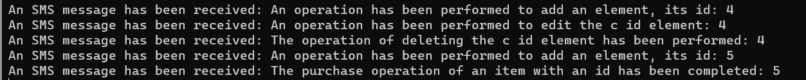
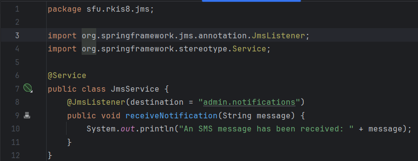
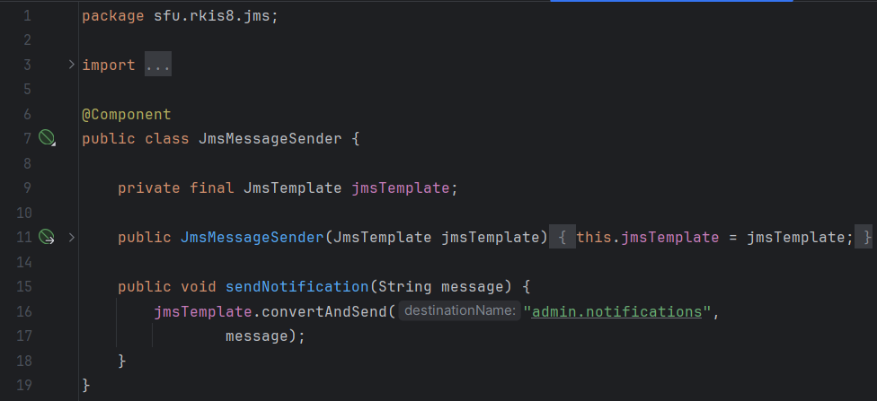

## Практическая работа №8
- Смолянинов Ярослав КИ21-16/1Б
- Вариант №23 (Часы)

Чтобы развернуть у себя базу данных, вам необходимо установить PostgerSQL на свое устройство, после чего запустить ее.
Создайте новую базу данных, войдя в консоль psql под своими данными и выполните следующие команды:
````
CREATE DATABASE postgres;
CREATE USER postgres WITH PASSWORD 'postgres';
\quit;
````

Затем подключиться к базе данных с помощью команды:
``
psql -h localhost -p 5222 -d postgres -U postgres
``

И теперь вставьте следующий текст:
````
CREATE TABLE watch (
id SERIAL PRIMARY KEY,
brand VARCHAR(255) NOT NULL,
type_watch VARCHAR(255) NOT NULL,
price numeric(8, 2) NOT NULL,
warranty_period int NOT NULL,
weight numeric(8, 2) NOT NULL,
purchased BOOLEAN NOT NULL DEFAULT false
);
````
Таблица "watch" будет создана. Теперь вы можете запустить файл Laba8.jar и подключиться к базе данных.

Затем запустите в отдельном терминале, перед этим вам необходимо перейти в терминале в папку, где у вас установлен apache-activemq, затем папка bin и win64 (в моем случае):
````
activemq start
````

Для компиляции и запуска проекта нужно ввести в терминале, находясь в корневой папке:
````
mvn clean package
java -jar target/Laba8-1.0-SNAPSHOT.jar
Открыть в бразуере localhost:8081
````

Переделывалась 5 лабораторная работа для выполнения лабораторной работы №8

Демонстрационный пример:



Класс для приёма административных сообщений и перехвата этих сообщений для вывода в консоль представлен на рисунках ниже.





Купленные товары не отображаются при дальнейшем использовании приложения, их столбец purchased отмечен как true.